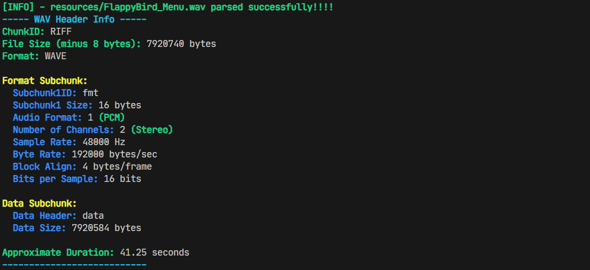

# Simple WAV File Parser in C

A lightweight WAV file parser written in C that reads standard RIFF/WAV headers,
supports skipping extra metadata chunks (like `smpl`, `LIST`), and extracts audio data info.

## Features

- Reads and validates WAV headers
- Supports 16-bit PCM, stereo and mono
- Skips unknown chunks safely (robust RIFF parsing)
- Prints header information and duration

## Example Output

| Terminal Output                                           |
|-------------------------------------------------------|
|  |

## License

This project is open source and free to use under the [MIT License](LICENCE).

