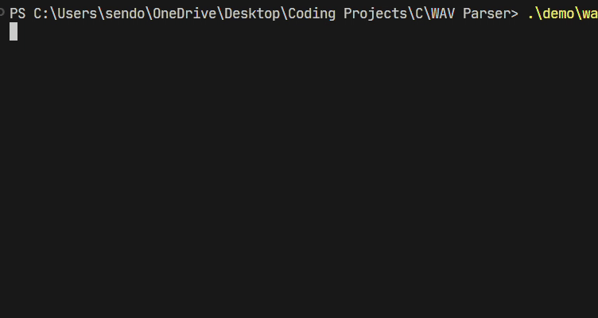

# Simple WAV File Parser and Player in C

`c-wav-player` is a lightweight WAV file parser and Win32 sound player written in C. It reads standard RIFF/WAV headers, skips non-audio metadata chunks (such as smpl, LIST, etc.), and extracts raw PCM audio data for playback via the Windows waveOut API.

## Features

- Reads and validates WAV headers
- Supports 16-bit PCM, stereo and mono
- Skips unknown chunks safely (robust RIFF parsing)
- Prints header information and duration

## Usage Example 

### Wav Parser

```c
#include "wav_parser.h"

int main(int argc, char const *argv[])
{
    wav_file_t file;
    wav_init_file(&file);
    if(wav_parse_file("resources/FlappyBird_Menu.wav", &file)) {
        wav_print_header(&file.header);
    }
    wav_free_file(&file);
    return 0;
}
```

### Win32 Soundplayer(using the wav parser)
```c
#include "win32/soundplayer.h"

//temporary code 
int main(int argc, char const *argv[])
{
    sound snd = sound_init("resources/FlappyBird_Menu.wav");
    sound_load(&snd);
    play_sound(&snd);
    playsound_ui_demo(&snd);
    sound_unload(&snd);
    return 0;
}
```

## Example Output

### WAV parser (header data display)

|          Success Output                               |
|-------------------------------------------------------|
|                            |

|          Error Output                                 |
|-------------------------------------------------------|
|                  |

### Win32 Soundplayer(using the wav parser)

|          Player Demo : Playing                        |
|-------------------------------------------------------|
|                     |

|          Player Demo : End                            |
|-------------------------------------------------------|
|                     |


## License

This project is open source and free to use under the [MIT License](LICENSE).

